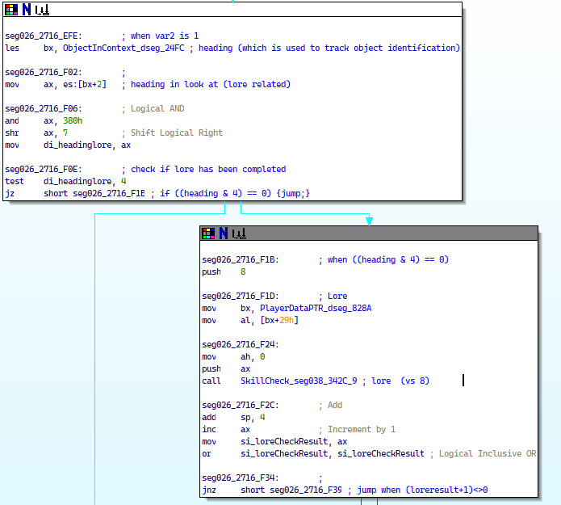
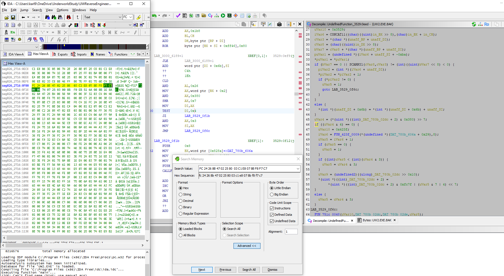

## Introduction

### Objective

Create a series of small patches to the original games where some mechanics are adjusted or circumvented. This won't create large patches, like those found in [UltimaHacks](https://github.com/JohnGlassmyer/UltimaHacks), only minor things.

This repo is temporary, just to store some thoughts and "publish" what I've been doing. Maybe I'll convert these into their own patcher, make HackProtos to use with UltimaHacks, or just keep them as-is.

### Origins

Once I saw a conversation on reddit about how Lore worked, and how it's a kinda annoying mechanic. You can only try to identify an item once per skill level, the item won't self-identify if you use it, paying for services can be quite expensive.

Some time later, when viewing another player going through UUW, I remembered that conversation and [hankmorgan's Reverse Engineering project](https://github.com/hankmorgan/UWReverseEngineering). I picked that up and probed around the notes, together with his implementation in the [UnderworldGodot](https://github.com/hankmorgan/UnderworldGodot) (and archived [UnderworldUnity](https://github.com/hankmorgan/UnderworldExporter)), and I was able to make a few minor mods. I wanted to share them, so here we are

## Applying the patches

Right now, you'll have to download a hex editor and edit the executables yourself. I use [HxD](https://mh-nexus.de/en/hxd/). I'll provide an offset (position) in the file and the values that need to be changed.

## Workflow

To make these patches, I load up the disassembly file from the Reverse Engineering project in IDA Pro 5. Then, I search for text occurrences of whatever I want to study. For example, I looked around for "Lore", among the results, you can find this:



This looks very promising. First, there's some mention of the player's lore skill, then there's a call to a function named "SkillCheck...". So if I can modify the file around this region, I'll get the result I want.

However, this is easier said than done, especially when looking at assembly. I load up the executable on [Ghidra](https://ghidra-sre.org/). To sync Ghidra and IDA, I do something a bit dumb (I'm looking into transferring the labels from one program to another). In IDA, I change to Hex view around a instruction, copy the whole line, then on Ghidra I search though Memory, and paste the line I copied earlier. Sometimes the result is garbled, so I click on the listing and use the disassemble command (D) to convert it to something useful. I then compare the listing from IDA and Ghidra, to confirm they're equal, and look at the reconstructed C code Ghidra provides.

Here's an example. I focused on the "test DI,0x4" line, which has a useful magic constant, copied the line highlighted in yellow on the left (this or the next line are fine), and the corresponding location in Ghidra on the right, with the "test DI,0x4" and the "if ((uVar4 & 4) == 0)" corresponding C code. This looks promising.



Looking up the listing in UnderworldGodot, the [correspondence is quite close](https://github.com/hankmorgan/UnderworldGodot/blob/e20d3d3590bef80021414db895514b71259330a7/src/interaction/look.cs#L10):

```C#
public static int LoreCheck(uwObject obj)
{
    if (
        CanBeIdentified(obj)
        )
    {//can be identified
        if ((obj.heading & 0x4) == 0)
        {//no attempt has been made yet. try and id now
            var result = (int)playerdat.SkillCheck(playerdat.Lore, 8);
            result++;
            if (result == 0)
            {
                result = 1;
            }
            if (result < (obj.heading & 0x3))
            {
                result = obj.heading & 0x3;//make sure identification does not lose a previous ID attempt if bit 3 has changed due to a lore skill increase
            }
            obj.heading = (short)(4 | result); //store result and flag that attempt was made.
            return result; //1,2 or 3
        }
        else
        {
            return obj.heading & 0x3; //return previous result
        }
    }
    return 1;//fail or cannot be identified
}
```

If I want the lore test to be repeatable, I can modify the test. Since it checks if the third bit is set (`0x100` is `4` decimal), I can just change `4` to be `0`, meaning this test is skipped, since anything ANDed with 0 is 0. With Ghidra, I can use the "Patch Instruction" function to modify the file, then use "File-Export Program" in the "Original File" format with a good name. This is convenient. To get the linear offset, I go back to IDA, because it provides the offset at the bottom of the hex view window (since I haven't yet figured out the weird offset addressing Ghidra provides).

The result of this is just a set of offsets and bytes that you have to change.

## Cheats themselves

These are provided with minimal testing 

### UUW2 original 

- SHA-256 checksum: BF233ABBFEB5B664564B954FC70C615C4023AD2276DD3326FCD34700C10AFDB9

#### Allow sequential Lore checks on the same item (mildly tested)

| offset | Original | New value | Meaning                                                                                                |
|--------|----------|-----------|--------------------------------------------------------------------------------------------------------|
| 28DA0  | 04       | 00        | This value represents a test that is made. 0x04 means, originally, "this item was analyzed previously" |

#### Every skill check is a critical success (untested!)

| offset | Original | New value | Meaning                                                                                                         |
|--------|----------|-----------|-----------------------------------------------------------------------------------------------------------------|
| 35022  | 01       | 02        | This, and the following values, are just patches to control the flow of that function to always return success. |
| 3502B  | 33       | 66        |                                                                                                                 |
| 3502C  | C0       | 90        |                                                                                                                 |
| 35030  | FF       | 02        |                                                                                                                 |
| 35031  | FF       | 00        |                                                                                                                 |

#### Increase inventory carry capacity on level up (untested!)

* Formula is (str * 13) + 300, in units of 0.1 stone (check!). By altering the multiplier and base values, we can increase this.
* Note how the carry weight is fixed at the start of the playthrough, but it's updated when leveling up because the same function is called in character generation and levelup... It sure would be cool to add some stat gain per level, but that's very difficult to do without messing up the executable.

| offset | Original | New value                          | Meaning                               |
|--------|----------|------------------------------------|---------------------------------------|
| 9AE03  | 1E       | Anything up to FF                  | Represents the base value. 0x1E = 30. |
| 9ADCF  | 05       | Anything lower than 05, but not 00 | Represents the divisor. 0x05 = 5.     |

* Found in function `CalculateHealthManaWeightValues_ovr154_93`

#### Increase player max vitality gain on level up (untested!)

* Formula is 30+(str * level)/5. By altering the base value or the divisor, we can increase this.

| offset | Original | New value                          | Meaning                               |
|--------|----------|------------------------------------|---------------------------------------|
| 9AE03  | 1E       | Anything up to FF                  | Represents the base value. 0x1E = 30. |
| 9ADCF  | 05       | Anything lower than 05, but not 00 | Represents the divisor. 0x05 = 5.     |

* Found in function `CalculateHealthManaWeightValues_ovr154_93`

#### Increase player max Mana value gain on level up (untested!)

* Formula is (Mana skill + 1) * Int / 8. We could alter this by changing the base value or the divisor, but the base value would require adding bytes, so only the divisor is possible right now.

| offset | Original | New value                       | Meaning                                                                          |
|--------|----------|---------------------------------|----------------------------------------------------------------------------------|
| 9AE22  | 3        | Anything lower than 3 (0, 1, 2) | Represents the right bit shift. A shift of 3 is equivalent to dividing by 2^3=8. |

* Found in function `CalculateHealthManaWeightValues_ovr154_93`

#### Change experience required for level ups (untested!)

* There's a table that displays the experience required for leveling up. These values, multiplied by 500d, are the thresholds required. These are in units of 0.1 XP (meaning lvl2 requires 50 xp.)


| offset | Original | New value | Meaning                                            |
|--------|----------|-----------|----------------------------------------------------|
| 69371  | 0        | 0         | lvl 1, Better not change this                      |
| 69372  | 1        | 1         | lvl 2, 500d, better not change this                |
| 69373  | 2        | 2         | lvl 3, 1000d, better not change this               |
| 69374  | 3        | 3         | lvl 4, 1500d, better not change this               |
| 69375  | 4        | 3         | lvl 5, 2000d, better not change this               |
| 69376  | 6        | 5 or 6    | lvl 6, 3000d, could change to 2500 (5h)            |
| 69377  | 8        | <8        | lvl 7, 4000d, could be 3000d (6), you get the idea |
| 69378  | 0C       | <0C       | lvl 8, 6000d                                       |
| 69379  | 10       | <10       | lvl 9, 8000d                                       |
| 6937A  | 18       | <18       | lvl 10, 12000d                                     |
| 6937B  | 20       | <20       | lvl 11, 16000d                                     |
| 6937C  | 30       | <30       | lvl 12, 24000d                                     |
| 6937D  | 40       | <40       | lvl 13, 32000d                                     |
| 6937E  | 60       | <60       | lvl 14, 48000d                                     |
| 6937F  | 80       | <80       | lvl 15, 64000d                                     |
| 69380  | C0       | <C0       | lvl 16, 96000d                                     |

* Found in `LevelUpTable_dseg_67d6_8E1`.

* Alternatively, one can change the multiplier from 500d (01F4h) to something else. For example, if you want the multiplier to be 250d, convert this to hex (00FAh), then fill in the bytes as required.

| offset | Original | New value | Meaning                                               |
|--------|----------|-----------|-------------------------------------------------------|
| 35199  | F4       | FA        | Forms the lower byte. New value is equivalent to 250d |
| 3519A  | 01       | 00        | Forms the upper byte                                  |

#### Increase number of skill points earned (untested!)

* Apparently every 1500d (05DCh) exp points you gain a skill point. By changing this value, you can earn skill points faster. For example, let's make this 1000d (3E8h).
* 
  | offset | Original | New value | Meaning                                               |
  |--------|----------|-----------|-------------------------------------------------------|
  | 350BB  | DC       | E8        | Forms the lower byte. New value is equivalent to 250d |
  | 350BC  | 05       | 03        | Forms the upper byte                                  |

* Found in `seg038_342C_CA`, `Experience_seg038_342C_45`

#### Increase number of experience points (untested!)

* In the game, for whatever reason, there's a division of the acquired experience points by 2. This can be changed to 1.
 
  | offset | Original | New value | Meaning                 |
  |--------|----------|-----------|-------------------------|
  | 3504A  | 02       | 01        | Pretty self-explanatory |

* As a side-effect, this will lower the variability in experience point acquisition.
* Found in `Experience_seg038_342C_45`.

#### Prevent death (untested!)

* In the game, every *tick*, the game checks for a lot of stuff. One of those is if your health is below 0, and then calls a function that handles death and resurrection. If we remove the call to that, we can circumvent death. In UW2, this also means fights in the pits, guards in the castle and dreaming in dream world.
* Note that if you get stuck somewhere and attempt to warp using death, if you have this, you'll be stuck (until you change the executable back).

| offset | Original | New value | Meaning                          |
|--------|----------|-----------|----------------------------------|
| 27F46  | 9A       | 90        | Changing the code from           |
| 27F47  | 75       | 90        | calling another function         |
| 27F48  | 00       | 90        | to NOP (no operation, opcode 90) |
| 27F49  | 99       | 90        |                                  |
| 27F4A  | 65       | 90        |                                  |

* Found in `PlayerUpdateTick_seg026_2716_8`

#### Increase natural health regen (untested!)

* `ovr135_21F`, `PlayerHPRegenerationChange_ovr156_3ED`, `ManaHealthRegeneration_dseg_67d6_190A`

#### Increase natural mana regen (untested!)

* `ManaChange_ovr156_33F`, `ManaHealthRegeneration_dseg_67d6_190A`

#### Longer lasting light sources (untested!)

* Instead of providing the duration requested by the function, we can substitute that for 1 always, decreasing the quality penalty less rapidly. This will also affect light decrease when sleeping!
* Found in `UpdateInventoryLightSources_ovr135_4E3`

| offset | Original | New value | Meaning                            |
|--------|----------|-----------|------------------------------------|
| 92F74  | 8B       | B4        | Changes instruction to MOV         |
| 92F75  | 46       | 01        | Decreases stability always by 1    |
| 92F76  | 06       | 90        | NOP, to fill it the remaining byte |

* We can also remove the call to this entirely. This won't remove the call that happens when you sleep! Let's keep that interesting mechanic.

| offset | Original | New value | Meaning                  |
|--------|----------|-----------|--------------------------|
| 92BB3  | E8       | 90        | Overwrites call with NOP |
| 92BB4  | 2D       | 90        |                          | 
| 92BB5  | 03       | 90        |                          |

* Found in `ovr135_1B3`

#### Neverending spells (untested!)

* A function is called periodically to reduce the stability of spells. After the stability period is over, the spell gets deactivated.
* This *shouldn't* make you unable to deactivate spells manually.

* We can control this either by removing the stability decrease (`ovr135_180`)
 
| offset | Original | New value | Meaning                               |
|--------|----------|-----------|---------------------------------------|
| 92B82  | 4A       | 90        | Removes the stability decrement.      |

* or removing the call to the deactivation routine (`ovr135_165`).

| offset | Original | New value | Meaning                               |
|--------|----------|-----------|---------------------------------------|
| 92B65  | E8       | 90        | Removes the call to cancel the spell. |
| 92B66  | 98       | 90        |                                       |
| 92B67  | FE       | 90        |                                       |


## TODOs

* Check how easy it is to transfer the cheats from the Underworlds, and the UltimaHacks versions.
* Test the hacks, at least a little.
* Revise how UltimaHacks project adds functions and see if I can inject some functions for custom content.
  * And also more space for cmb.dat
  * Two cheats, one to move to other worlds, and another to move within the world, would be hyper cool. But maybe it'd be easier to edit the player and world data of saved games, then load them.
* 

## Ideas

* Adjust difficulty of skill checks
* Adjust hunger gain/loss